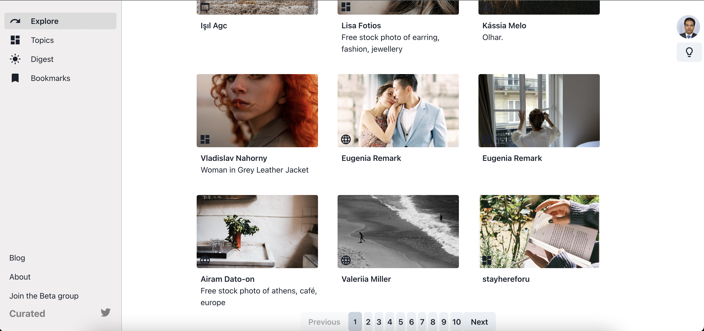

# Assignment

This is full stack assignment to build FE and BE based on this [UI](https://dribbble.com/shots/6187917/attachments/1326507?mode=media)

### Screenshots

#### Web

#### Mobile

# Front-end
(Url)[https://bespoke-blancmange-8677a2.netlify.app]
Front-end is in `client` folder.

## ToolStack

- React
- Typescript
- Chakra-UI
- MUI

## Feature

- Mobile responsive
- Pagination
- Dark/light mode
- Search query is debounce to 1000 ms
- Images have placeholders while image loading. You can also update placeholder by adding env variable REACT_APP_IMAGE_PLACEHOLDER
- Shows menu drawer on mobile
- material icons
- tested

|    Environment Variable     | Default Pagination count |
| :-------------------------: | :----------------------: |
|    REACT_APP_PAGES_COUNT    | Default Pagination count |
|      REACT_APP_API_URL      |        Url of api        |
| REACT_APP_IMAGE_PLACEHOLDER |    Placeholder image     |
|     REACT_APP_TOKEN_KEY     |    API JWT token key     |

#### Getting started

- Go to `client` folder by `cd client`
- install dependency by `yarn` or `npm install`
- start server by `yarn dev`
- test `yarn test`

#### Note

- Due to limitation icons might not be same
- Color might be different

# Back-end
(Url)[https://pelicargo-test.onrender.com/]
Backend code is in `server` folder

## ToolStack

- Node
- Typescript
- Express
- JWT Authentication
- Winston (logging)
- ava(testing)

## Api Endpoint

- Method: GET

  Url: `api/v1/explore`

  |  params  |     description     |
  | :------: | :-----------------: |
  |  query   | Search Query params |
  |   page   |   pagination page   |
  | per_page |    list per page    |

| Environment Variable | Default Pagination count |
| :------------------: | :----------------------: |
|       NODE_ENV       |     Node environment     |
|         PORT         |       Server port        |
|      PEXELS_KEY      |      Pexels api key      |
|       PER_PAGE       |     Default per page     |
|     ALLOW_ORIGIN     |       Cors origin        |
|      TOKEN_KEY       |         JWT Key          |

#### Getting started

- Go to `server` folder by `cd server`
- install dependency by `yarn` or `npm install`
- Build js by running `yarn build`
- start server by `yarn dev`
- test `yarn test`
